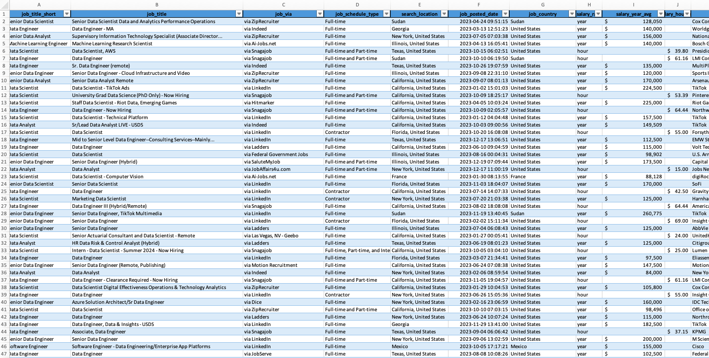
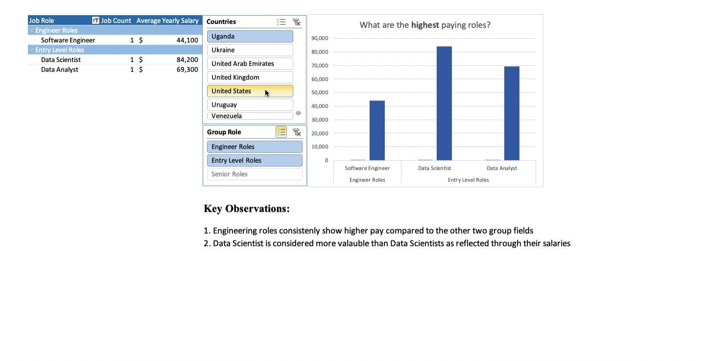
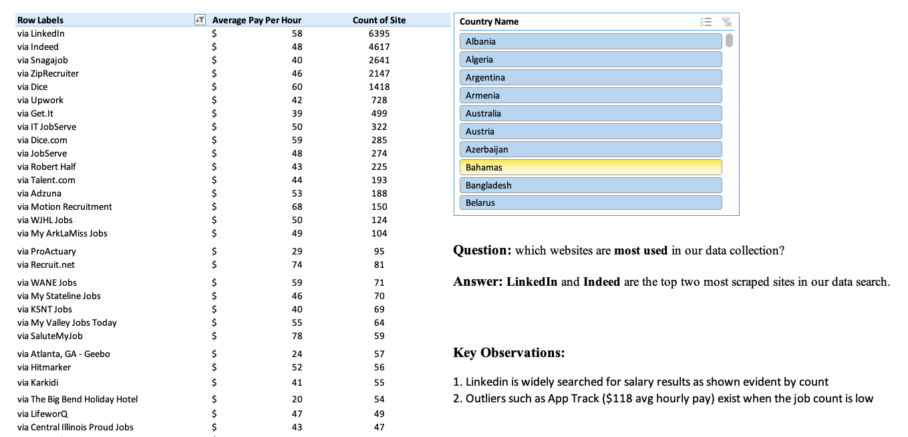

# [📊 Payday Perspectives: Salary Analytics Dashboard 📊](Payday%20Perspectives.xlsx) 

## Introduction  

**Payday Perspectives** takes a deep dive into the job market, focusing on salary trends for data professionals. By analyzing roles, locations, and salary ranges, this dashboard offers valuable insights into career prospects and earning potential in data-related fields. Think of it as your cheat sheet to navigating the world of data careers.

---

## Questions to Analyze  

1. **How do salary ranges vary by location, job type, and job title?**
2. **What are the average salaries across different data job roles?**  
3. **Where are the job roles extracted from?**  

---

## Excel Skills Used  

- **📊 Pivot Tables**  
- **📌 Conditional Formatting**  
- **🔄 Data Cleaning and Validation**  
- **🧮 Statistical Analysis**  
- **🔍 Filtering and Sorting**  

---

## Data Overview  

The dataset consolidates information on data job postings, including:

- **📋 Job Titles**: Roles like Data Scientist, **Machine Learning Engineer**, etc.
- **📆 Job Schedules**: Full-time, part-time, or flexible positions.
- **💼 Job Platforms**: Sources like **Indeed**, ZipRecruiter, etc. 
- **🌍 Location**: Specific cities, states, and countries where jobs are posted.  
- **💰 Salary Details**: Yearly and hourly **rates** for posted roles.  
  

 

---

## Analysis Highlights  

### 1️⃣ **How do salary ranges vary by location, job type, and job title?**  

#### 📈 Methodology  
- Utilized the **dashboard** for visualizing location and job title-based salary trends.  
- Used dynamic slicers to adjust for job type and regions.  

#### 💡 Insights  
- **Senior Data Engineer** roles in California offered the highest average salaries, exceeding $160,000/year.  
- Entry-level roles in smaller regions showed significant variation based on job type.  

  

  

---

### 2️⃣ **What are the average salaries across different data job roles?**  

#### 🔍 Methodology  
- Analyzed the **Pivot_Roles** sheet to group job roles and calculate averages.  
- Highlighted key trends using pivot table summaries.  

#### 💡 Insights  
- **Machine Learning Engineers** commanded the highest salaries at $145,000/year on average.  
- **Data Analysts** roles remained popular, though with an average salary of $85,000/year.  

  

---

### 3️⃣ **Where are the job roles extracted from?**  

#### 🧮 Methodology  
- Used the **Pivot_Via** sheet to count and compare postings by region and platform.  
- Created heatmaps to visualize job posting density.  

#### 💡 Insights  
- **Indeed** and **LinkedIn** led as the top platforms for job postings in North America.  
- Internationally, postings were more distributed across platforms many sites.  

---

## Conclusion  

The **Payday Perspectives** dashboard sheds light on the rapidly growing data job market. Through analyzing salary trends and job availability, this project made clear the salaries for job given certain parameters. These insights helped me make informed decisions and stay ahead in this crazy data-driven world.

---

### 📂 Access the Project  

Click [here](Payday%20Perspectives.xlsx) to explore the **Payday Perspectives** spreadsheet in more detail. (Note: the workbook is protected to maintain data integrity.)

