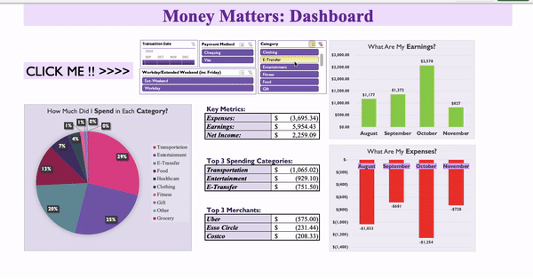
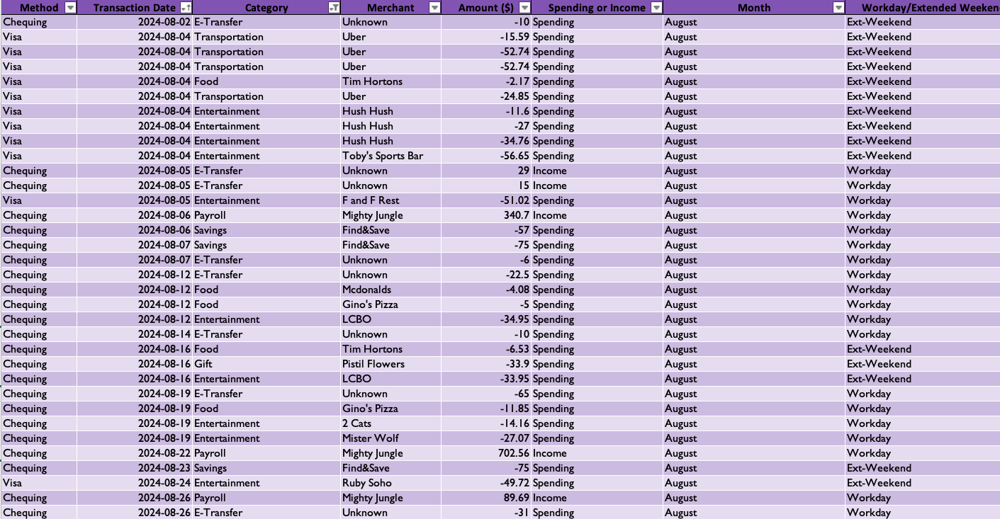
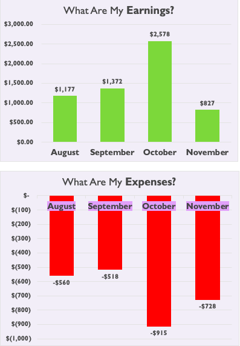
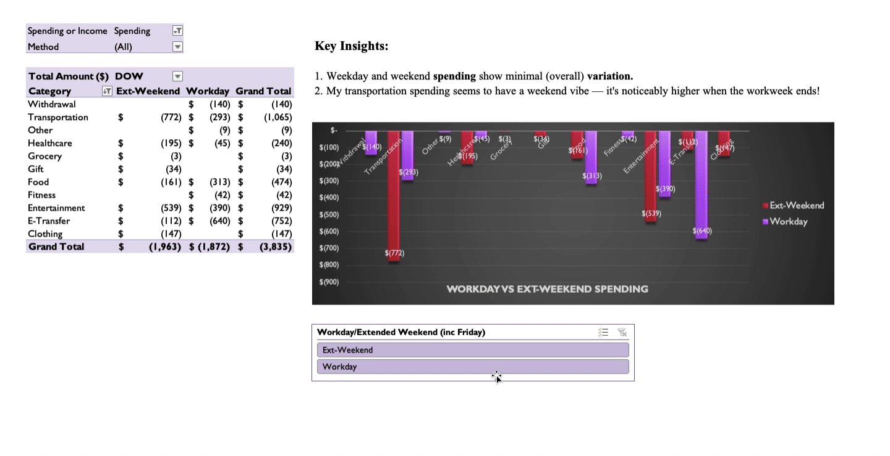
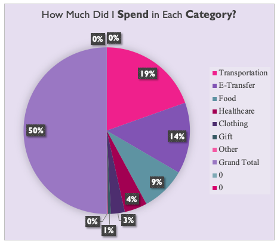

# [💰 Money Matters: Spending Habits Analysis 💰](Money%20Matters.xlsx) 

## Introduction  

Ever feel like your wallet’s playing hide and seek? **Money Matters** is my personal quest to decode the mysteries of where my hard-earned cash disappears each month. I’ve analyzed my RBC transactions and built a **dynamic dashboard** to map out my financial habits. It's like having my own personal accountant—without the boring spreadsheets (well, mostly).  

---

## Questions to Analyze  

1. **How do earnings compare to expenses over time?**  
2. **How does my weekday spending stack up against my weekend habits?**  
3. **What are the major categories of my expenses?**  

---

## Excel Skills Used  

- **📊 Pivot Tables**  
- **📈 Charts and Graphs**  
- **🧮 Dynamic Dashboards**  
- **🔄 Data Cleaning**  
- **🖊 Statistical Analysis**  

---

## Data Overview  

The dataset includes transaction details from my RBC VISA and Debit accounts, featuring:  

- **💵 Transaction Amounts** – The total spending or earnings for each transaction.
- **📅 Dates** – The date each transaction occurred.
- **🛍️ Categories** – Categories like **Groceries**, **Entertainment**, etc.
- **🛒 Merchants** – The stores or services where I made purchases.
- **💰 Earnings or Expenses** – Indicates whether the transaction was income or an expense.

 

---

## Analysis Highlights  

### 1️⃣ **How do earnings compare to expenses over time?**  

#### 📈 Methodology  
- Used **pivot tables** (dynamic tables summarizing data) integrated with **slicers** (interactive filters) to track and compare earnings and expenses.  
- Employed visualizations to properly capture the results.

#### 💡 Insights  
- During the summer, **expenses overtook earnings**, hinting at some budget-busting indulgences.  
- October 2023 stood out as a financial win, with a notable surplus thanks to tighter control on less useful spending.

  

---

### 2️⃣ **How does my weekday spending stack up against my weekend habits?**  

#### 🔍 Methodology  
- Filtered transactions by weekday and weekend using Excel formulas.  
- Created a **clustered column chart** to compare average daily spending.  

#### 💡 Insights  
- **Ext-Weekend** and **Worday** spending show minimal overall variation
- Weekdays showed a steady trend of smaller, necessity-driven expenses like groceries and transport vs transportation on weekends 

---

### 3️⃣ **What are the major categories of my expenses?**  

#### 🧮 Methodology  
- Grouped transactions into categories like **Groceries**, **Rent**, **Dining**, and more.  
- Leveraged **Pivot Tables** to calculate totals for each category.  

#### 💡 Insights  
- Transportation and Entertainment consistently claimed the biggest slice of the pie, accounting for about **25% of total expenses for each**.  
- Of the Transportation spending, Uber was **marginally higher** compared to the other merchants. 

---

## Conclusion  

The **Money Matters** project has been a financial eye-opener, revealing where my dollars go and how to save them better. With Excel’s analytics magic, I’ve spotted areas for improvement, identified spending trends, and maybe, just maybe, convinced myself to skip that late-night pizza run. By leveraging these insights, I’m now better equipped to manage my finances effectively.

---

### 📂 Access the Project  

Click [here](Money%20Matters.xlsx) to explore the **Money Matters** spreadsheet in more detail. (Note: the workbook is protected to maintain data integrity.)  

---

- Check out some of my other work:  
  - [📊 SQL Projects](https://github.com/JulianGriffin11/SQL_Projects)  
  - [📘 R Projects](https://github.com/JulianGriffin11/R_Projects)

Kind Regards,  
Julian

 
