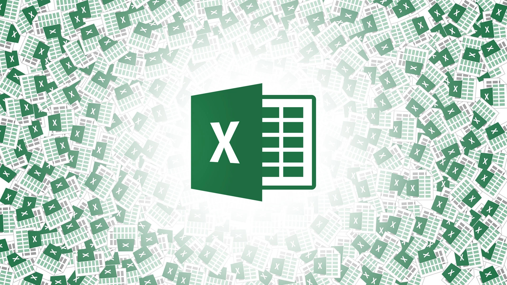
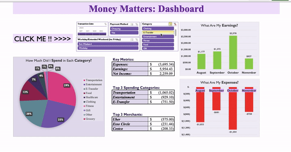

# 📈 Excel Projects  

Welcome to my **Excel_Projects** repository! 🌟  

This space highlights my journey into Excel-based **data analysis**, showcasing my unique projects. Use the **links below** to explore each one!  

---

## 🗂️ Projects  

### 1. [**💰 Project 1 - Money Matters 💰**](./Project%201%20-%20Money%20Matters)
- **Summary**: My personal finance tracker designed to streamline budgeting. Features include an automated categorization of earnings and expenses via a dashboard and more.  
- **Skills Learned**: 
  - Tob Down Dynamic Dashboard
  - Advanced Pivot Tables
  - Data Visualization, and more!   

 

---

### 2. [**📊 Project 2 - Payday Perspectives 📊**](./Project%202%20-%20Payday%20Perspectives)
 
- **Summary**: Job market analysis dashboard that simplifies salary tracking within the data field. Includes dynamic visuals and fields for better interpretation.  
- **Skills Learned**: 
  - Advanced Excel functions (e.g., **VLOOKUP**, **INDEX-MATCH**)
  - Conditional formatting to indicate outliers
  - Detailed Pivot tables, and more!
    
 

---

✨ Click the heading links to dive deeper into each project! 🚀  

Enjoy, **Julian Griffin :)**

